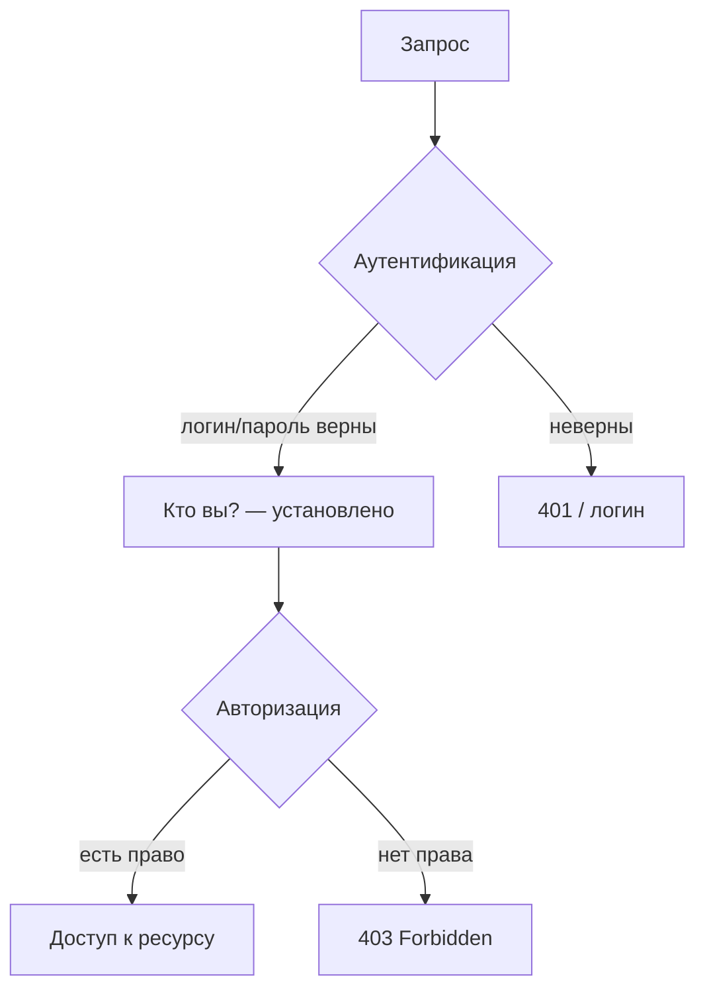
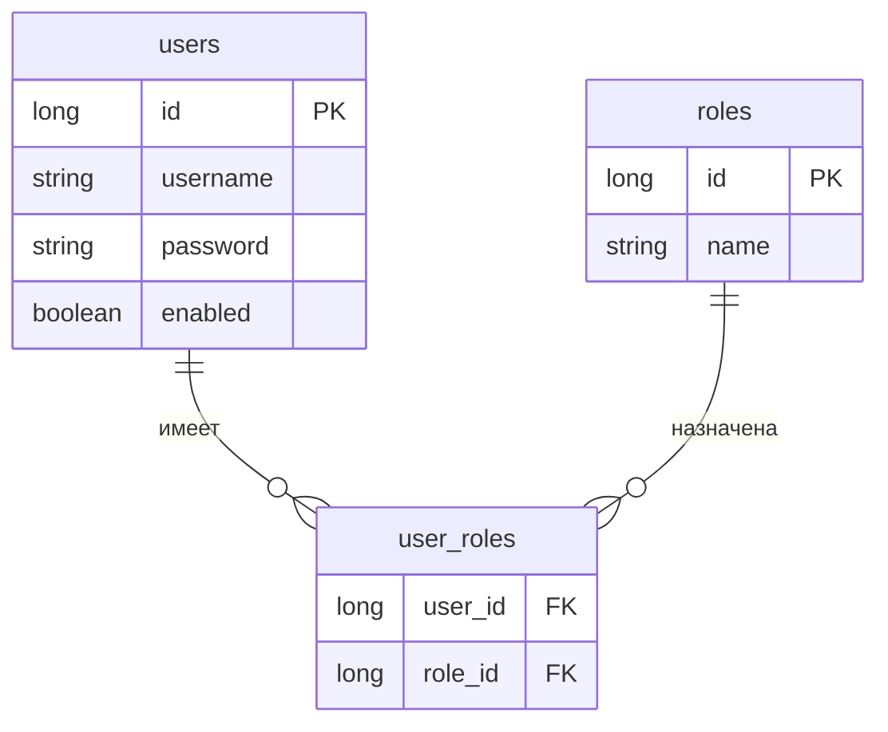
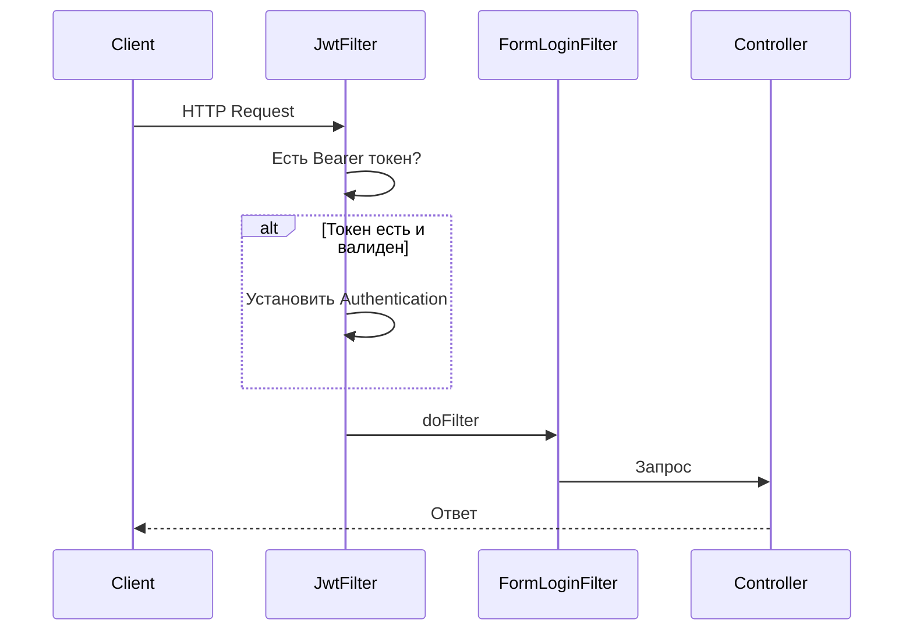
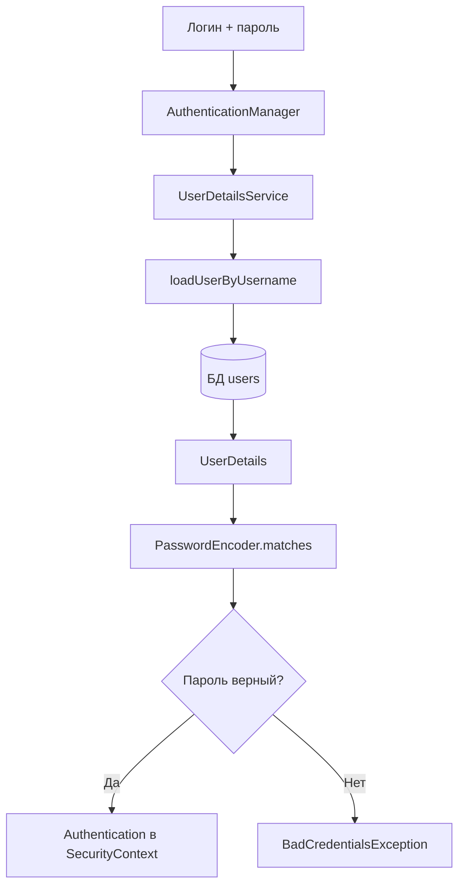
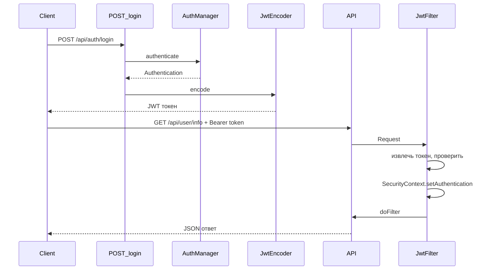
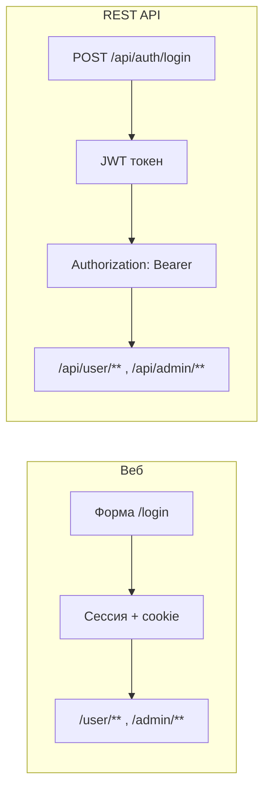

# Spring Security — вопросы и ответы

Файл в формате вопросов и ответов по Spring Security на основе демо-проекта.

---

## Основы Spring Security

### Q: Что такое Spring Security?

**A:** Spring Security — фреймворк для обеспечения безопасности в Spring-приложениях. Он предоставляет:
- **Аутентификацию** — проверку личности пользователя (логин/пароль)
- **Авторизацию** — проверку прав доступа к ресурсам
- **Защиту от атак** — CSRF, XSS и др.

---

### Q: В чём разница между Authentication и Authorization?

**A:**
- **Authentication (аутентификация)** — «Кто вы?»: проверка личности (логин/пароль).
- **Authorization (авторизация)** — «Что вы можете делать?»: проверка прав доступа к ресурсам.

Сначала выполняется аутентификация, затем авторизация.



---

### Q: Что такое SecurityFilterChain?

**A:** SecurityFilterChain — цепочка фильтров, через которую проходит каждый HTTP-запрос до контроллера. Фильтры проверяют:
- аутентификацию пользователя;
- авторизацию (права доступа);
- CSRF-токены;
- другие аспекты безопасности.

---

## UserDetailsService и пароли

### Q: Что такое UserDetailsService?

**A:** UserDetailsService — интерфейс Spring Security для загрузки пользовательских данных. В нём один метод:

```java
UserDetails loadUserByUsername(String username)
```

Spring Security вызывает его при аутентификации, чтобы получить объект `UserDetails` (логин, пароль, роли) по имени пользователя.

---

### Q: Зачем нужен PasswordEncoder?

**A:** PasswordEncoder нужен для хранения паролей в зашифрованном виде:

- пароли не хранятся в открытом виде;
- даже администратор БД не видит реальные пароли;
- используется одностороннее хеширование (расшифровать нельзя).

В проекте используется **BCryptPasswordEncoder**.

---

### Q: Как устроен BCrypt?

**A:** BCrypt — это адаптивная функция хеширования паролей (на базе шифра Blowfish). Основные моменты:

- **Соль:** при каждом вызове `encode(пароль)` генерируется случайная соль (128 бит). Соль **не хранится отдельно** — она встроена в итоговую строку хеша.
- **Формат хеша:** строка вида  
  `$2a$12$LQv3c1yqBWVHxkd0LHAkCOYz6TtxMQJqhN8/X4.VTtYxR7R5QK/5u`  
  где:
  - `2a` — версия алгоритма;
  - `12` — cost factor (число раундов 2^12), влияет на время вычисления;
  - следующие 22 символа — соль (Base64);
  - остальное — сам хеш (31 символ).
- **Односторонность:** по хешу нельзя восстановить пароль; проверка только через `matches(введённыйПароль, хешИзБД)`.
- **Адаптивность:** cost factor можно увеличивать со временем (например, с 10 до 12), чтобы компенсировать рост мощности железа.

В проекте используется `BCryptPasswordEncoder(12)` — strength 12.

---

### Q: Как работает CustomUserDetailsService?

**A:** Последовательность шагов:

1. Пользователь вводит логин и пароль.
2. Spring Security вызывает `loadUserByUsername(username)`.
3. Сервис загружает пользователя из БД.
4. Роли преобразуются в `GrantedAuthority`.
5. Возвращается объект `UserDetails`.
6. Spring Security проверяет пароль через `PasswordEncoder`.
7. При совпадении пароля пользователь считается аутентифицированным.

---

## Роли и авторизация

### Q: Как работает авторизация на основе ролей?

**A:**

1. У пользователя одна или несколько ролей (USER, ADMIN и т.д.).
2. Роли хранятся в БД и связаны с пользователем (например, Many-to-Many).
3. При аутентификации роли превращаются в `GrantedAuthority`.
4. Spring Security проверяет роли при обращении к защищённым ресурсам.

---

### Q: В чём разница между hasRole() и hasAuthority()?

**A:**

- **hasRole("ADMIN")** — автоматически добавляет префикс `"ROLE_"`, ищет `"ROLE_ADMIN"`.
- **hasAuthority("ROLE_ADMIN")** — ищет точное совпадение `"ROLE_ADMIN"`.

В проекте роли хранятся с префиксом `"ROLE_"`, поэтому удобнее использовать `hasRole()`.

---

### Q: Что такое @PreAuthorize?

**A:** Аннотация для проверки прав **до** выполнения метода:

```java
@PreAuthorize("hasRole('ADMIN')")
public String adminMethod() { ... }
```

Если у пользователя нет нужной роли, метод не выполнится и будет выброшено `AccessDeniedException`.

Требуется `@EnableMethodSecurity(prePostEnabled = true)` в конфигурации. При том же включённом `prePostEnabled` можно использовать **@PostAuthorize** (проверка после выполнения метода, например по возвращённому объекту) и **@Secured** (проверка по ролям: `@Secured("ADMIN")`).

---

### Q: Что такое GrantedAuthority?

**A:** GrantedAuthority — интерфейс, описывающий право доступа. В Spring Security роли представляются как `GrantedAuthority` с префиксом `"ROLE_"`. Например, роль `"ADMIN"` хранится как `"ROLE_ADMIN"`.

---

### Q: Как добавить новую роль?

**A:**

1. Создать роль в БД через `RoleRepository`.
2. Назначить роль пользователю через `UserRepository`.
3. Обновить правила в `SecurityConfig` (например, `requestMatchers`) или использовать `@PreAuthorize` на методах.

---

## Сессии и CSRF

### Q: Как управляются сессии?

**A:** В `SecurityConfig` задаётся, например:

```java
.sessionManagement(session -> session
    .sessionCreationPolicy(SessionCreationPolicy.IF_REQUIRED)
    .maximumSessions(1)
    .maxSessionsPreventsLogin(false)
)
```

- **IF_REQUIRED** — сессия создаётся при необходимости.
- **maximumSessions(1)** — не более одной активной сессии на пользователя.
- **maxSessionsPreventsLogin(false)** — новая сессия может закрыть предыдущую.

---

### Q: Как работает защита от CSRF?

**A:** **CSRF (Cross-Site Request Forgery)** — атака, при которой пользователя заставляют выполнить нежелательный запрос.

Spring Security:

- генерирует уникальный токен для сессии;
- требует этот токен в POST/PUT/DELETE;
- проверяет токен перед обработкой запроса.

В демо-проекте CSRF отключён для упрощения; в продакшене его нужно включать.

---

## REST API и JWT

### Q: Как защитить REST API?

**A:** В проекте показано:

- использование `@RestController`;
- аннотации `@PreAuthorize` на методах API;
- возврат JSON;
- **JWT** для stateless-аутентификации.

Пример:

```java
@GetMapping("/api/user/info")
@PreAuthorize("hasAnyRole('USER', 'ADMIN')")
public ResponseEntity<Map<String, Object>> userInfo() { ... }
```

---

### Q: Какую роль выполняет JWT в проекте?

**A:** JWT используется для **stateless-аутентификации REST API**:

- клиент получает токен через `POST /api/auth/login`;
- далее отправляет запросы с заголовком `Authorization: Bearer <token>`;
- сервер не хранит сессии; личность и роли берутся из токена.

Для веб-страниц по-прежнему используется аутентификация по сессии (форма логина).

---

### Q: Как работает JWT-аутентификация?

**A:**

1. **Получение токена**
   - POST `/api/auth/login` с username и password.
   - Сервер проверяет данные через `AuthenticationManager`.
   - При успехе создаётся JWT через `JwtTokenProvider` (JwtEncoder) и возвращается клиенту.

2. **Использование токена**
   - Запросы с заголовком `Authorization: Bearer <token>`.
   - `JwtAuthenticationFilter` извлекает токен, проверяет через JwtDecoder, достаёт username и роли, создаёт `Authentication` и кладёт его в `SecurityContext`.

3. **Валидация**
   - Проверяется подпись токена и срок действия (exp).

---

### Q: В чём разница между JWT и Session-based аутентификацией?

**A:**

| Аспект            | JWT                    | Session-based                    |
|-------------------|------------------------|----------------------------------|
| Хранение          | Токен у клиента        | Session ID у клиента, данные на сервере |
| Stateless         | Да                     | Нет                              |
| Масштабирование   | Проще                  | Нужно общее хранилище (Redis, БД) |
| Отзыв             | Сложнее (blacklist)    | Удалить сессию                   |
| Размер            | Больше (есть payload)  | Меньше (только ID)               |
| Типичное использование | REST API, микросервисы | Веб-приложения с формами         |

В проекте: **Session-based** — для веб-страниц, **JWT** — для `/api/**`.

---

### Q: Как работает JwtAuthenticationFilter?

**A:** Фильтр для каждого запроса:
1. Извлекает токен из заголовка `Authorization: Bearer <token>`.
2. Валидирует токен через `JwtTokenProvider` (JwtDecoder).
3. Извлекает username и роли из токена.
4. Создаёт объект `Authentication`.
5. Устанавливает его в `SecurityContext`.

Он стоит **перед** `UsernamePasswordAuthenticationFilter`: при наличии валидного JWT используется он, иначе — форма логина.

---

### Q: Как настроить время жизни JWT?

**A:** В `application.properties`:

```properties
jwt.expiration=86400000  # 24 часа в миллисекундах
```

В коде:

```java
@Value("${jwt.expiration}")
private long jwtExpirationMs;
```

Рекомендуют: access token — 15 минут–1 час; refresh token (если есть) — 7–30 дней.

---

### Q: Какие библиотеки Spring используются для JWT?

**A:** В проекте используются официальные модули Spring Security:
- **spring-security-oauth2-jose** — работа с JWT (JOSE).
- **spring-security-oauth2-resource-server** — OAuth2 Resource Server.
- **NimbusJwtEncoder** и **NimbusJwtDecoder** — реализация на базе Nimbus JOSE + JWT SDK.

---

### Q: Как получить и использовать JWT в проекте?

**A:**

```bash
# 1. Получить токен
curl -X POST http://localhost:8080/api/auth/login \
  -H "Content-Type: application/json" \
  -d '{"username":"admin","password":"admin123"}'

# 2. Использовать токен в запросах
curl http://localhost:8080/api/user/info \
  -H "Authorization: Bearer <полученный_токен>"
```

---

## Модель данных

### Q: Как устроена связь User–Role (Many-to-Many)?

**A:**
- Таблица `users` — пользователи.
- Таблица `roles` — роли.
- Таблица `user_roles` — связь многие-ко-многим.

Один пользователь может иметь несколько ролей, одна роль — у многих пользователей.



---

### Q: Какие поля у сущности User и зачем enabled? Почему роли EAGER?

**A:** В проекте сущность `User` содержит:

- **id** — первичный ключ.
- **username** — уникальный логин (используется при аутентификации).
- **password** — хеш пароля (BCrypt), в БД хранится только он.
- **enabled** — флаг «учётная запись активна». Spring Security при аутентификации проверяет `UserDetails.isEnabled()`; если `false`, вход запрещён (удобно для временной блокировки без удаления пользователя).
- **roles** — множество ролей (связь Many-to-Many с `Role`).

Роли загружаются **EAGER** (`FetchType.EAGER`), чтобы при вызове `loadUserByUsername()` один запрос (с join) сразу подтягивал пользователя и роли. Иначе при обращении к `user.getRoles()` в `CustomUserDetailsService` пришлось бы держать сессию Hibernate или делать отдельный запрос; EAGER упрощает код в контексте «загрузил пользователя — сразу отдай в SecurityContext с ролями». Минус — лишняя выборка ролей, если они не нужны; для сценария логина это обычно приемлемо.

---

## Диаграммы (Mermaid)

### Цепочка фильтров (SecurityFilterChain)



### Аутентификация через UserDetailsService



### JWT: получение и использование токена



### Два способа аутентификации в проекте



---

## Быстрые ответы

| Вопрос                         | Краткий ответ |
|--------------------------------|---------------|
| Где настраивать доступ по URL? | `SecurityConfig`, метод `securityFilterChain()`, `authorizeHttpRequests()` |
| Где хранятся пользователи?     | В БД (JPA), загрузка через `CustomUserDetailsService` |
| Как включить проверку по ролям в методах? | `@EnableMethodSecurity(prePostEnabled = true)` и `@PreAuthorize` |
| Какой эндпоинт выдаёт JWT?      | `POST /api/auth/login` с телом `{"username":"...","password":"..."}` |
| В каком заголовке передавать JWT? | `Authorization: Bearer <token>` |

---

*Документ составлен по демо-проекту Spring Security. Подробности — в [README.md](../README.md).*
